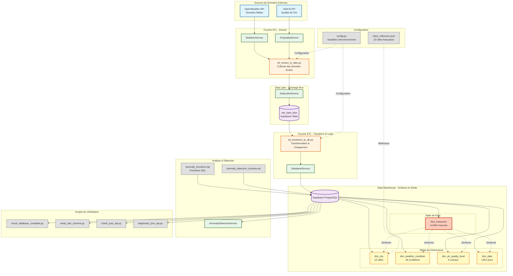

# Schéma d'Architecture Principale

Ce schéma montre l'architecture complète du système avec les flux de données entre les différents composants.

## Légende

| Couleur | Composant |
|---------|-----------|
| 🔵 Bleu clair | APIs Externes |
| 🟠 Orange | Pipeline ETL |
| 🟣 Violet | Stockage (Data Lake, Data Warehouse) |
| 🟢 Vert | Services |
| 🟡 Jaune | Tables de Dimensions |
| 🔴 Rouge/Orange | Table de Faits |
| ⚫ Gris | Scripts & Configuration |

## Description des Composants

### Sources de Données
- **OpenWeather API** : Fournit les données météorologiques
- **AQICN API** : Fournit les données de qualité de l'air

### Services
- **WeatherService** : Gestion des appels à OpenWeather API
- **AirQualityService** : Gestion des appels à AQICN API
- **DataLakeService** : Gestion du stockage dans le Data Lake
- **DatabaseService** : Gestion de la connexion Supabase
- **AnomalyDetectionService** : Détection des valeurs anormales

### Pipeline ETL
- **etl_extract_to_lake.py** : Extraction et stockage brut
- **etl_transform_to_db.py** : Transformation et chargement

### Stockage
- **raw_data_lake** : Stockage brut des réponses API (20,706 enregistrements)
- **Data Warehouse** : Schéma en étoile optimisé pour l'analyse

### Tables de Dimensions
- **dim_city** : Référentiel des villes
- **dim_weather_condition** : Types de conditions météorologiques
- **dim_air_quality_level** : Niveaux de qualité de l'air
- **dim_date** : Dimension temporelle (calendrier)

### Table de Faits
- **fact_measures** : Mesures environnementales (14,904 enregistrements)
