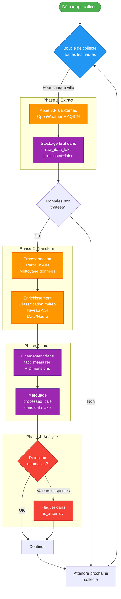

# Flux de Données ETL

Ce schéma décrit le processus complet de collecte, transformation et chargement des données.

## Détail des Phases

### Phase 1 : Extract (Extraction)
**Durée** : ~20-30 secondes par cycle complet (10 villes × 2 APIs)

1. **Démarrage** : Lancement automatique via cron ou manuel
2. **Boucle de collecte** : Itération sur les 10 villes configurées
3. **Appels API** :
   - OpenWeather API : Données météo actuelles
   - AQICN API : Données qualité de l'air
4. **Stockage brut** :
   - Insertion dans `raw_data_lake`
   - Conservation de la réponse JSON complète
   - Flag `processed=false`
   - Horodatage `collected_at`

### Phase 2 : Transform (Transformation)
**Durée** : ~5-10 secondes par lot de données

1. **Parsing JSON** :
   - Extraction des valeurs pertinentes
   - Validation des types de données
   - Gestion des valeurs NULL ou manquantes

2. **Enrichissement** :
   - **Classification météo** : Mapping weather_id → category (sunny, rainy, etc.)
   - **Niveau AQI** : Classification de l'AQI en niveaux (Good, Moderate, Unhealthy, etc.)
   - **Date/Heure** : Extraction et formatage du timestamp
   - **Géolocalisation** : Association à la ville via city_id

3. **Validation** :
   - Vérification des plages de valeurs (temp entre -50 et 60°C)
   - Cohérence inter-polluants (AQI vs PM2.5/PM10)
   - Détection des doublons

### Phase 3 : Load (Chargement)
**Durée** : ~2-5 secondes par lot

1. **Chargement dans fact_measures** :
   - Insertion des mesures transformées
   - Création des liens avec les dimensions (FK)
   - Traçabilité vers le data lake (raw_weather_id, raw_aqi_id)

2. **Mise à jour des dimensions** :
   - Insertion de nouvelles conditions météo (si nouvelles)
   - Mise à jour des métadonnées ville (si modifiées)

3. **Marquage** :
   - `processed=true` dans raw_data_lake
   - `processed_at=CURRENT_TIMESTAMP`

### Phase 4 : Analyse (Détection d'Anomalies)
**Durée** : ~1-2 secondes

1. **Détection automatique** :
   - Valeurs hors plage normale (température, AQI)
   - Écarts statistiques (> 3σ de la moyenne)
   - Incohérences entre polluants

2. **Flagging** :
   - `is_anomaly=true` dans fact_measures
   - Insertion dans anomaly_log avec raison
   - Peut déclencher des alertes (futures)

## Fréquence de Collecte

- **Collecte** : Toutes les **60 minutes** (configurable via `COLLECTION_INTERVAL`)
- **Volume par heure** : ~20 enregistrements (10 villes × 2 sources)
- **Volume par jour** : ~480 enregistrements
- **Volume par mois** : ~14,400 enregistrements

## Gestion des Erreurs

| Type d'erreur | Action |
|---------------|--------|
| API non disponible | Log + Skip + Retry au prochain cycle |
| Réponse invalide | Log + Stockage avec flag error |
| Timeout | Retry 3× puis skip |
| Parse JSON échoue | Log + Marquer comme erreur dans data lake |
| Violation de contrainte BDD | Rollback + Log + Investigation |

## Monitoring

Indicateurs à surveiller :
- ✅ Taux de succès des appels API
- ✅ Taux de transformation réussie
- ✅ Temps de traitement par phase
- ✅ Nombre d'anomalies détectées
- ✅ % de valeurs NULL par métrique
