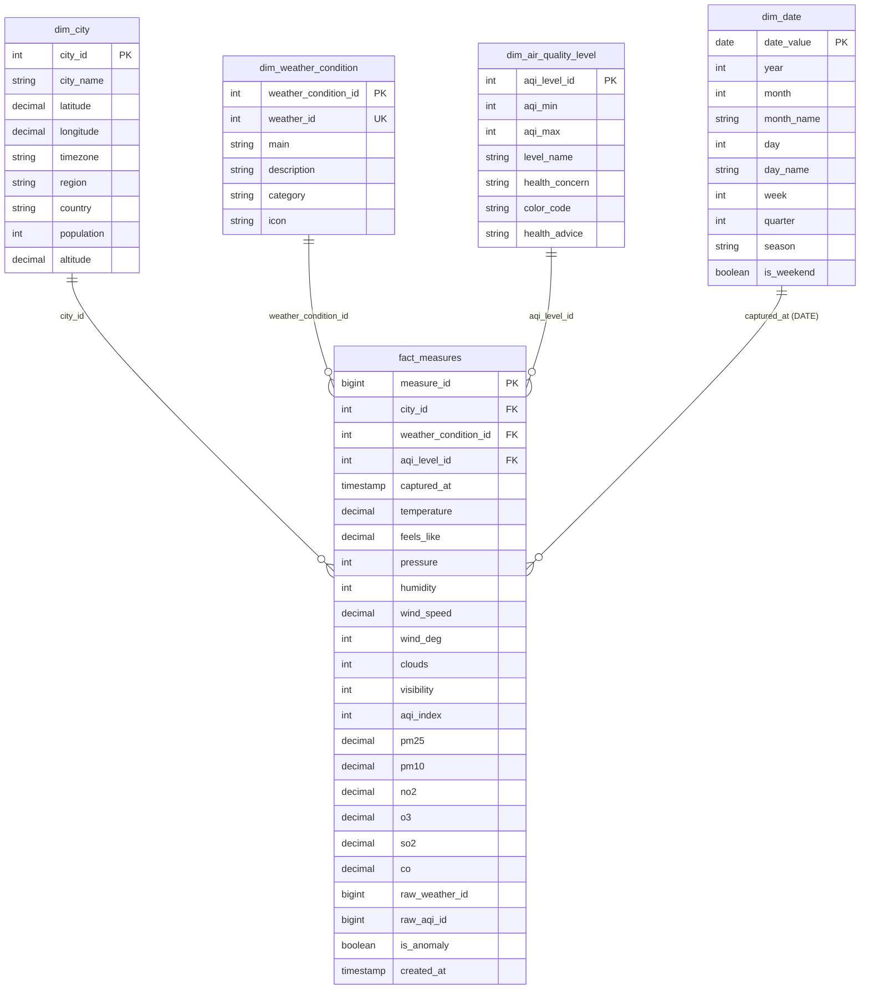

# Schéma en Étoile (Star Schema)

Ce schéma illustre le modèle de données du Data Warehouse optimisé pour les analyses OLAP.



## Tables de Dimensions

### 📍 dim_city (10 enregistrements)

Référentiel des villes françaises suivies.

| Colonne | Type | Description |
|---------|------|-------------|
| city_id | INTEGER | Identifiant unique (PK) |
| city_name | VARCHAR(100) | Nom de la ville |
| latitude | DECIMAL(9,6) | Latitude GPS |
| longitude | DECIMAL(9,6) | Longitude GPS |
| timezone | VARCHAR(50) | Fuseau horaire |
| region | VARCHAR(100) | Région administrative |
| country | VARCHAR(100) | Pays (France) |
| population | INTEGER | Population (optionnel) |
| altitude | DECIMAL(7,2) | Altitude en mètres |

**Exemples** :
- Paris (48.8566, 2.3522)
- Lyon (45.7640, 4.8357)
- Marseille (43.2965, 5.3698)

---

### ☁️ dim_weather_condition (36 enregistrements)

Classification des conditions météorologiques OpenWeather.

| Colonne | Type | Description |
|---------|------|-------------|
| weather_condition_id | INTEGER | Identifiant unique (PK) |
| weather_id | INTEGER | Code OpenWeather (UK) |
| main | VARCHAR(50) | Catégorie principale |
| description | VARCHAR(100) | Description détaillée |
| category | VARCHAR(20) | Classification simplifiée |
| icon | VARCHAR(10) | Code icône |

**Catégories** :
- Clear (Ciel dégagé)
- Clouds (Nuageux)
- Rain (Pluie)
- Drizzle (Bruine)
- Thunderstorm (Orage)
- Snow (Neige)
- Mist/Fog (Brouillard)

---

### 🌫️ dim_air_quality_level (6 enregistrements)

Niveaux de qualité de l'air selon l'échelle AQI.

| Colonne | Type | Description |
|---------|------|-------------|
| aqi_level_id | INTEGER | Identifiant unique (PK) |
| aqi_min | INTEGER | Seuil minimum AQI |
| aqi_max | INTEGER | Seuil maximum AQI |
| level_name | VARCHAR(50) | Nom du niveau |
| health_concern | VARCHAR(100) | Préoccupation santé |
| color_code | VARCHAR(20) | Code couleur |
| health_advice | TEXT | Conseils santé |

**Niveaux** :
| AQI | Niveau | Couleur | Signification |
|-----|--------|---------|---------------|
| 0-50 | Good | Vert | Qualité satisfaisante |
| 51-100 | Moderate | Jaune | Acceptable |
| 101-150 | Unhealthy for Sensitive | Orange | Mauvais pour groupes sensibles |
| 151-200 | Unhealthy | Rouge | Mauvais pour tous |
| 201-300 | Very Unhealthy | Violet | Très mauvais |
| 301+ | Hazardous | Marron | Dangereux |

---

### 📅 dim_date (1,461 enregistrements)

Dimension calendrier couvrant 2024-2027.

| Colonne | Type | Description |
|---------|------|-------------|
| date_value | DATE | Date (PK) |
| year | INTEGER | Année (2024-2027) |
| month | INTEGER | Mois (1-12) |
| month_name | VARCHAR(10) | Nom du mois |
| day | INTEGER | Jour du mois (1-31) |
| day_name | VARCHAR(10) | Nom du jour |
| week | INTEGER | Numéro de semaine |
| quarter | INTEGER | Trimestre (1-4) |
| season | VARCHAR(10) | Saison |
| is_weekend | BOOLEAN | Weekend ou non |

**Saisons** :
- Winter : Décembre, Janvier, Février
- Spring : Mars, Avril, Mai
- Summer : Juin, Juillet, Août
- Fall : Septembre, Octobre, Novembre

---

## Table de Faits

### 📊 fact_measures (14,904 enregistrements)

Table centrale contenant toutes les mesures environnementales.

#### Clés et Références

| Colonne | Type | Description |
|---------|------|-------------|
| measure_id | BIGSERIAL | Identifiant unique (PK) |
| city_id | INTEGER | Ville (FK → dim_city) |
| weather_condition_id | INTEGER | Condition météo (FK → dim_weather_condition) |
| aqi_level_id | INTEGER | Niveau AQI (FK → dim_air_quality_level) |
| captured_at | TIMESTAMP | Horodatage de la mesure |

#### Métriques Météorologiques

| Colonne | Type | Unité | Description |
|---------|------|-------|-------------|
| temperature | DECIMAL(5,2) | °C | Température |
| feels_like | DECIMAL(5,2) | °C | Température ressentie |
| pressure | INTEGER | hPa | Pression atmosphérique |
| humidity | INTEGER | % | Humidité relative |
| wind_speed | DECIMAL(5,2) | m/s | Vitesse du vent |
| wind_deg | INTEGER | ° | Direction du vent |
| clouds | INTEGER | % | Couverture nuageuse |
| visibility | INTEGER | m | Visibilité |

#### Métriques Qualité de l'Air

| Colonne | Type | Unité | Description |
|---------|------|-------|-------------|
| aqi_index | INTEGER | - | Indice AQI global |
| pm25 | DECIMAL(7,2) | µg/m³ | Particules fines 2.5µm |
| pm10 | DECIMAL(7,2) | µg/m³ | Particules 10µm |
| no2 | DECIMAL(7,2) | µg/m³ | Dioxyde d'azote |
| o3 | DECIMAL(7,2) | µg/m³ | Ozone |
| so2 | DECIMAL(7,2) | µg/m³ | Dioxyde de soufre |
| co | DECIMAL(7,2) | µg/m³ | Monoxyde de carbone |

#### Traçabilité et Métadonnées

| Colonne | Type | Description |
|---------|------|-------------|
| raw_weather_id | BIGINT | Lien vers raw_data_lake (météo) |
| raw_aqi_id | BIGINT | Lien vers raw_data_lake (AQI) |
| is_anomaly | BOOLEAN | Flag détection d'anomalie |
| created_at | TIMESTAMP | Date d'insertion en BDD |

---

## Exemples de Requêtes OLAP

### 1. Température moyenne par ville et saison

```sql
SELECT 
    c.city_name,
    d.season,
    ROUND(AVG(fm.temperature), 1) as avg_temp,
    COUNT(*) as nb_measures
FROM fact_measures fm
JOIN dim_city c ON fm.city_id = c.city_id
JOIN dim_date d ON DATE(fm.captured_at) = d.date_value
WHERE fm.temperature IS NOT NULL
GROUP BY c.city_name, d.season
ORDER BY c.city_name, d.season;
```

### 2. Qualité de l'air par ville

```sql
SELECT 
    c.city_name,
    aql.level_name,
    COUNT(*) as nb_measures,
    ROUND(COUNT(*) * 100.0 / SUM(COUNT(*)) OVER (PARTITION BY c.city_name), 1) as percentage
FROM fact_measures fm
JOIN dim_city c ON fm.city_id = c.city_id
JOIN dim_air_quality_level aql ON fm.aqi_level_id = aql.aqi_level_id
GROUP BY c.city_name, aql.level_name
ORDER BY c.city_name, aql.aqi_min;
```

### 3. Corrélation météo et pollution

```sql
SELECT 
    wc.main as weather_condition,
    ROUND(AVG(fm.aqi_index), 1) as avg_aqi,
    ROUND(AVG(fm.temperature), 1) as avg_temp,
    COUNT(*) as nb_measures
FROM fact_measures fm
JOIN dim_weather_condition wc ON fm.weather_condition_id = wc.weather_condition_id
WHERE fm.aqi_index IS NOT NULL
GROUP BY wc.main
ORDER BY avg_aqi DESC;
```

### 4. Tendance hebdomadaire (weekend vs semaine)

```sql
SELECT 
    c.city_name,
    CASE WHEN d.is_weekend THEN 'Weekend' ELSE 'Semaine' END as period,
    ROUND(AVG(fm.aqi_index), 1) as avg_aqi,
    ROUND(AVG(fm.temperature), 1) as avg_temp
FROM fact_measures fm
JOIN dim_city c ON fm.city_id = c.city_id
JOIN dim_date d ON DATE(fm.captured_at) = d.date_value
WHERE fm.aqi_index IS NOT NULL
GROUP BY c.city_name, d.is_weekend
ORDER BY c.city_name, period;
```

---

## Index et Optimisations

### Index sur fact_measures

```sql
-- Clés étrangères
CREATE INDEX idx_fact_city ON fact_measures(city_id);
CREATE INDEX idx_fact_weather ON fact_measures(weather_condition_id);
CREATE INDEX idx_fact_aqi ON fact_measures(aqi_level_id);

-- Temporal
CREATE INDEX idx_fact_captured_at ON fact_measures(captured_at);

-- Composite pour requêtes fréquentes
CREATE INDEX idx_fact_city_date ON fact_measures(city_id, captured_at);

-- Métriques
CREATE INDEX idx_fact_aqi_index ON fact_measures(aqi_index);
CREATE INDEX idx_fact_temp ON fact_measures(temperature);
```

### Performance

- **Taille actuelle** : ~14,904 enregistrements
- **Croissance** : ~480 enregistrements/jour
- **Estimation 1 an** : ~175,000 enregistrements
- **Taille estimée** : ~50-100 MB (avec index)

---

## Avantages du Schéma en Étoile

✅ **Simplicité** : Requêtes simples avec peu de jointures
✅ **Performance** : Optimisé pour les agrégations
✅ **Flexibilité** : Facile d'ajouter de nouvelles dimensions
✅ **Compréhensible** : Structure intuitive pour les analystes
✅ **Dénormalisé** : Moins de jointures = plus rapide

## Limitations

⚠️ **Redondance** : Certaines données répétées (optimisation lecture)
⚠️ **Mises à jour** : Modifications de dimensions peuvent être complexes
⚠️ **Espace disque** : Plus volumineux qu'un schéma normalisé
